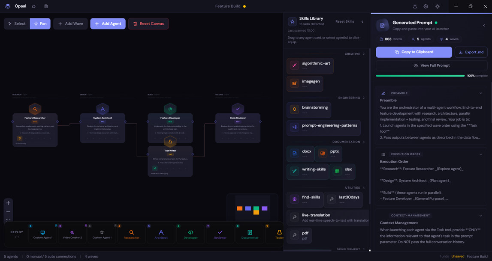
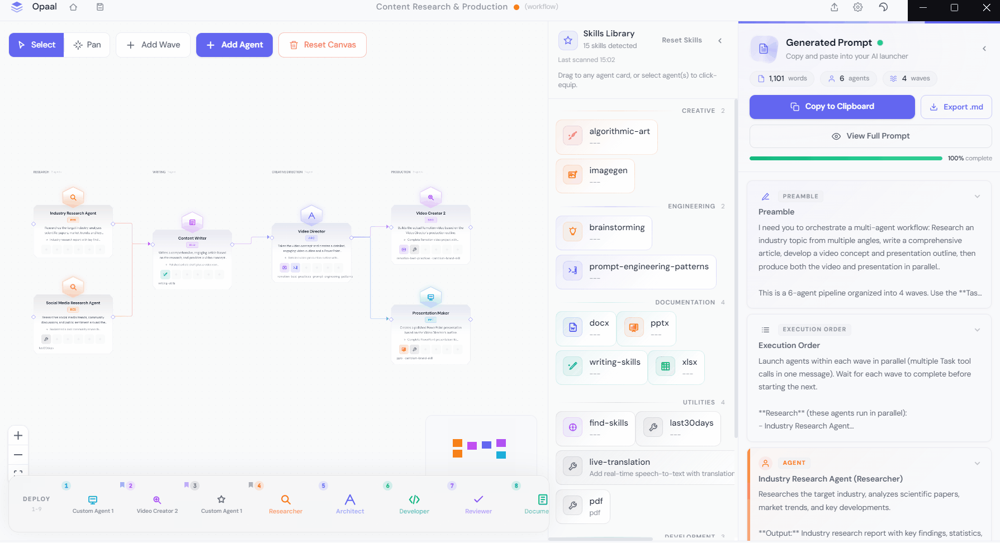

# Opaal

**Orchestration Prompts for Agentic AI Launch**

[](LICENSE)
[](https://github.com/Agravak/opaal/releases)
[](https://github.com/Agravak/opaal/actions/workflows/ci.yml)

> Design multi-agent AI pipelines visually. Drag, drop, connect, and export production-ready prompts for Claude Code and other agentic AI platforms.

> **Disclaimer:** Opaal is an independent, community-driven open-source project. It is not affiliated with, endorsed by, sponsored by, or officially connected to Anthropic, PBC or any of its products. "Claude" and "Claude Code" are trademarks of Anthropic, PBC. All other trademarks belong to their respective owners. Use of these names is purely for descriptive and interoperability purposes.





## What is Opaal?

Opaal is a desktop application that lets you design multi-agent workflows visually and export them as structured prompts for [Claude Code](https://docs.anthropic.com/en/docs/claude-code) and other agentic AI launchers. Instead of writing complex orchestration prompts by hand, you drag agent cards onto a canvas, configure their roles and skills, draw connections between them, and Opaal generates the prompt automatically.

## Features

- **Visual Workflow Canvas** - Drag-and-drop agent cards with zoom, pan, and minimap
- **7 Agent Roles** - Researcher, Architect, Developer, Reviewer, Tester, Documenter, Custom
- **Smart Auto-Connections** - Agents in adjacent phases connect automatically
- **Manual Wiring** - Override auto-connections with custom gradient-colored edges
- **Live Prompt Preview** - See your prompt update in real-time as you design
- **3 Starter Templates** - Code Review, Feature Build, Bug Investigation
- **Skills Integration** - Auto-detects installed Claude Code skills from `~/.claude/skills`
- **Dark & Light Themes** - Linear-inspired minimal aesthetic
- **Save & Share** - `.opaal` files for workflow portability
- **Export to CLAUDE.md** - One-click export for Claude Code and compatible platforms
- **Keyboard-Driven** - Full shortcuts, undo/redo (50 levels), multi-select, control groups
- **Context Menus** - Right-click for quick actions on canvas and nodes
- **Copy/Paste** - Duplicate agents with connections preserved

## Download

Download the latest release for your platform:

| Platform | Download |
|----------|----------|
| Windows | [Opaal.exe](https://github.com/Agravak/opaal/releases/latest) |
| macOS | [Opaal.dmg](https://github.com/Agravak/opaal/releases/latest) |
| Linux | [Opaal.AppImage](https://github.com/Agravak/opaal/releases/latest) |

> **Windows users:** Opaal is a portable app — no installation needed. Just download and run the `.exe` directly. Windows SmartScreen may show a warning since the app is not code-signed; click "More info" then "Run anyway" to proceed.

Or [view all releases](https://github.com/Agravak/opaal/releases).

## Quick Start

1. **Open Opaal** and pick a starter template (or start from scratch)
2. **Add phases** (columns) representing execution stages
3. **Add agents** with roles like Researcher, Developer, Reviewer
4. **Configure** each agent's skills, instructions, and expected output
5. **View the prompt** in the Prompt tab - it updates live
6. **Copy or Export** the prompt to use in Claude Code or your preferred AI launcher

## How It Works

```
Visual Canvas  -->  Prompt Engine  -->  CLAUDE.md / Clipboard
(drag & drop)      (auto-generate)     (paste into your AI launcher)
```

Opaal converts your visual workflow into a structured natural-language prompt. Each agent becomes a section with its role, skills, inputs, outputs, and instructions. Connections define data flow. Columns define execution order (parallel within a column, sequential across columns).

## Templates

### Code Review Pipeline
Analyze code -> Review for issues -> Generate documentation

### Feature Build
Research requirements -> Design architecture -> Build + Test (parallel) -> Validate

### Bug Investigation & Fix
Investigate root cause -> Implement fix -> Test fix -> Document changes

## Keyboard Shortcuts

| Shortcut | Action |
|----------|--------|
| `Ctrl+S` | Save workflow |
| `Ctrl+O` | Open workflow |
| `Ctrl+E` | Export prompt as file |
| `Ctrl+Z` | Undo |
| `Ctrl+Shift+Z` | Redo |
| `Ctrl+D` | Duplicate selected |
| `Ctrl+C` / `Ctrl+V` | Copy / Paste agents |
| `Delete` | Remove selected agent |
| `Escape` | Deselect |
| `Shift+Click` | Multi-select |
| `Ctrl+1-9` | Save control group |
| `1-9` | Recall control group |

## Development

### Prerequisites

- Node.js 18+
- npm

### Setup

```bash
git clone https://github.com/Agravak/opaal.git
cd opaal
npm install
npm run dev
```

The Electron app opens automatically with hot reload.

### Build

```bash
npm run build          # Build for production
npm run build:win      # Windows portable exe
npm run build:mac      # macOS dmg
npm run build:linux    # Linux AppImage
```

### Project Structure

```
src/
  main/           # Electron main process (window, IPC, file dialogs, skills scanner)
  preload/        # Context bridge (exposes APIs to renderer)
  renderer/src/   # React app
    components/   # UI components (canvas, nodes, sidebar, layout, shared)
    stores/       # Zustand state management (workflow, UI, skills)
    lib/          # Core logic (prompt generator, auto-connect, templates)
    hooks/        # React hooks (keyboard shortcuts)
    styles/       # Tailwind CSS v4 + design tokens
    types/        # TypeScript interfaces
```

### Tech Stack

- [Electron](https://www.electronjs.org/) + [electron-vite](https://electron-vite.org/) - Desktop app shell
- [React 18](https://react.dev/) + [TypeScript](https://www.typescriptlang.org/) - UI framework
- [React Flow](https://reactflow.dev/) (@xyflow/react) - Canvas with zoom, pan, drag, connections
- [Tailwind CSS v4](https://tailwindcss.com/) - Styling with design tokens
- [Zustand](https://zustand.docs.pmnd.rs/) - Lightweight state management
- [Framer Motion](https://www.framer.com/motion/) - Animations
- [Monaco Editor](https://microsoft.github.io/monaco-editor/) - Code editor (prompt preview)

## Contributing

Contributions are welcome! See [CONTRIBUTING.md](CONTRIBUTING.md) for guidelines.

## License

[MIT](LICENSE)

## Privacy

Opaal runs entirely on your local machine. It:

- **Does not** collect, transmit, or store any data on external servers
- **Does not** include analytics, telemetry, or tracking of any kind
- **Does not** call any APIs or connect to any cloud services
- Reads your local `~/.claude/skills` directory solely to auto-detect installed skills for convenience
- Saves all workflow files (`.opaal`) locally on your machine
- Does not require an internet connection to operate

## Disclaimer & Limitation of Liability

Opaal is provided "as is", without warranty of any kind, express or implied. The authors and copyright holders shall not be liable for any claim, damages, or other liability arising from the use of this software.

Prompts generated by Opaal are provided as suggestions only. Users are solely responsible for reviewing, modifying, and using generated prompts in compliance with all applicable terms of service and laws. Opaal makes no guarantees about the suitability, accuracy, or effectiveness of generated prompts.

## Acknowledgments

- [React Flow](https://reactflow.dev/) by xyflow for the incredible canvas library
- [Tailwind CSS](https://tailwindcss.com/) for the utility-first styling approach
- [Anthropic](https://www.anthropic.com/) for Claude Code
